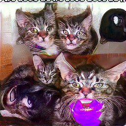
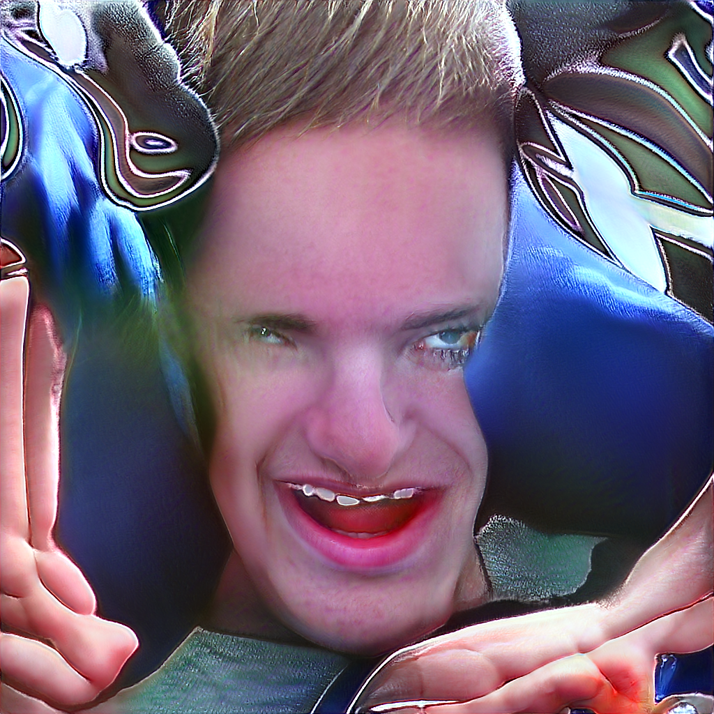

# stylegan2-ada x CLIP
[](https://colab.research.google.com/github/ysig/stylegan2-ADAxCLIP/blob/main/stylegan2_ada%20x%20CLIP.ipynb)

A simple notebook and derived from that of https://twitter.com/advadnoun  
(see: https://colab.research.google.com/drive/1NCceX2mbiKOSlAd_o7IU7nA9UskKN5WR?usp=sharing )
to imagine pictures from sentences based on a model (defined on the Stylegan2-ada architecture and the CLIP model)

Comes with a cli:

```
usage: stylegan2ada-image [-h] [-i TEXT] -n NETWORK [-e NUM_EPOCHS]
                          [-p TOTAL_PLOTS] [-b BATCH_SIZE] [-s STYLEGAN2_DIR]
                          [-c CLIP_DIR] [--seed SEED] [-o OUTDIR]

optional arguments:
  -h, --help            show this help message and exit
  -i TEXT, --text TEXT
  -n NETWORK, --network NETWORK
  -e NUM_EPOCHS, --num-epochs NUM_EPOCHS
  -p TOTAL_PLOTS, --total-plots TOTAL_PLOTS
  -b BATCH_SIZE, --batch-size BATCH_SIZE
  -s STYLEGAN2_DIR, --stylegan2-dir STYLEGAN2_DIR
  -c CLIP_DIR, --clip-dir CLIP_DIR
  --seed SEED
  -o OUTDIR, --outdir OUTDIR 
```  

You will need to download and install the dependencies need for [CLIP](https://github.com/openai/CLIP) and [stylegan2-ada-pytorch](https://github.com/NVlabs/stylegan2-ada-pytorch).  
(CUDA-11 - pytorch=1.7.1)

# Example

Your cat looks like the devil!



(from `stylegan2-cat-config-f.pkl`)

Hacker



(from `ffhq.pkl`)

# Citations

Thanks to https://twitter.com/advadnoun for creating the original collab notebook https://colab.research.google.com/drive/1NCceX2mbiKOSlAd_o7IU7nA9UskKN5WR?usp=sharing !

Thanks to the creators of stylegan2-ada-pytorch!

@inproceedings{Karras2020ada,
  title     = {Training Generative Adversarial Networks with Limited Data},
  author    = {Tero Karras and Miika Aittala and Janne Hellsten and Samuli Laine and Jaakko Lehtinen and Timo Aila},
  booktitle = {Proc. NeurIPS},
  year      = {2020}
}

Stylegan2-ada-pytorch comes with a LICENSE: https://github.com/NVlabs/stylegan2-ada-pytorch/blob/main/LICENSE.txt

Thanks to the authors below & OpenAI for sharing CLIP! https://github.com/openai/CLIP

Alec Radford \* Jong Wook Kim \* Chris Hallacy Aditya Ramesh Gabriel Goh Sandhini Agarwal
Girish Sastry Amanda Askell Pamela Mishkin Jack Clark Gretchen Krueger
Ilya Sutskever
